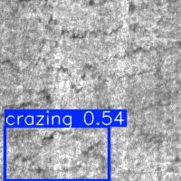
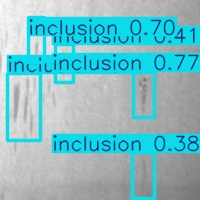
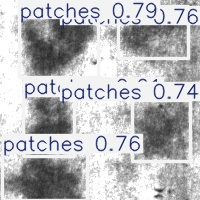
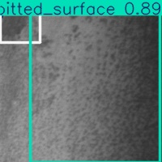
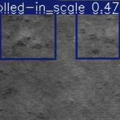
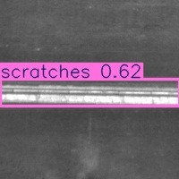

# Crystal Vision AI

A computer vision project for automated steel surface defect detection using YOLOv8. This project implements an end-to-end machine learning pipeline for quality control in steel manufacturing, capable of identifying and classifying six types of surface defects.

## 🎯 Project Overview

Crystal Vision AI leverages state-of-the-art object detection models to identify defects in steel surfaces, enabling automated quality control processes. The system is trained on the NEU Surface Defect Database and can detect the following defect types:

- **Crazing**: Fine cracks on the surface
- **Inclusion**: Non-metallic particles embedded in the steel
- **Patches**: Irregular surface areas with different texture
- **Pitted Surface**: Small cavities or depressions
- **Rolled-in Scale**: Scale pressed into the surface during rolling
- **Scratches**: Linear surface damage

## 🛠️ Tech Stack

- **Python 3.10**: Core programming language
- **YOLOv8 (Ultralytics)**: Object detection model
- **PyTorch**: Deep learning framework
- **MLflow**: Experiment tracking and model registry
- **DVC**: Data version control
- **Docker**: Containerization for reproducible environments
- **OpenCV**: Image processing
- **Pandas & NumPy**: Data manipulation
- **Matplotlib**: Visualization

## 📁 Project Structure

```
crystal-vision-ai/
├── config/
│   └── data.yaml                 # Dataset configuration for YOLO
├── data/                         # (gitignored, managed by DVC)
│   ├── raw/                      # Raw dataset from Kaggle
│   ├── processed/                # Preprocessed data (train/val splits)
│   └── external/                 # Additional data sources
├── src/
│   ├── data_loader/              # Data ingestion scripts
│   │   └── ingest_data.py        # Kaggle dataset downloader
│   ├── features/                 # Feature engineering
│   │   ├── build_features.py     # Feature extraction
│   │   └── convert_annotations.py # Annotation format conversion
│   ├── models/                   # Model training scripts
│   │   ├── train_model.py        # Training pipeline v1
│   │   └── train_v2.py           # Training pipeline v2
│   └── visualization/            # Prediction and visualization
│       ├── predict.py            # Inference script
│       └── visualize_results.py  # Results visualization
├── models/
│   ├── saved_models/             # Trained model checkpoints
│   └── *.pt                      # (gitignored, YOLO pretrained weights)
├── results/                      # Sample detection results
├── runs/                         # (gitignored, YOLO training outputs)
│   └── detect/                   # Detection prediction results
├── docker-compose.yml            # Docker orchestration
├── Dockerfile                    # Container configuration
├── requirements.txt              # Python dependencies
└── README.md                     # This file
```

> **Note**: Folders marked as `(gitignored)` are generated during execution or managed by DVC. They won't be in the repository but will be created when running the project.

## 🚀 Getting Started

### Prerequisites

- Docker and Docker Compose
- NVIDIA GPU with CUDA support (optional but recommended)
- Kaggle API credentials (for dataset download)

### Installation

1. **Clone the repository**
   ```bash
   git clone https://github.com/mpenalab/crystal-vision-ai.git
   cd crystal-vision-ai
   ```

2. **Set up environment variables**
   
   Create a `.env` file from the example:
   ```bash
   cp .env.example .env
   ```
   
   Add your Kaggle API token:
   ```
   KAGGLE_API_TOKEN=your_kaggle_token_here
   ```

3. **Build and run with Docker**
   ```bash
   docker-compose up -d
   ```

4. **Access the container**
   ```bash
   docker exec -it steel_app bash
   ```

### Downloading the Dataset

Inside the container, run:
```bash
python src/data_loader/ingest_data.py
```

This will download the NEU Surface Defect Database from Kaggle to `data/raw/`.

### Preprocessing Data

Convert annotations and prepare the dataset:
```bash
python src/features/convert_annotations.py
```

This creates the train/validation splits in `data/processed/`.

## 🏋️ Training

### Basic Training

Run the training script:
```bash
python src/models/train_model.py
```

Default configuration:
- **Model**: YOLOv8n (nano)
- **Epochs**: 15
- **Image Size**: 640x640
- **Batch Size**: 16
- **Device**: CPU (change to GPU in script if available)

### Advanced Training

For longer training with augmentation:
```bash
python src/models/train_v2.py
```

### Monitoring with MLflow

Access the MLflow UI at `http://localhost:5000` to track experiments, compare runs, and manage models.

## 🔍 Inference

Run predictions on validation images:
```bash
python src/visualization/predict.py
```

This script:
- Randomly selects 15 validation images
- Runs inference with the trained model
- Saves annotated images with detected defects
- Uses a confidence threshold of 0.25

Results are saved in the `runs/detect/` directory.

## 📊 Model Performance

The model is evaluated on:
- **Precision**: Accuracy of positive predictions
- **Recall**: Coverage of actual defects
- **mAP (Mean Average Precision)**: Overall detection performance
- **F1 Score**: Harmonic mean of precision and recall

Metrics are tracked in MLflow for each training run.

## 🐳 Docker Services

The project includes two Docker services:

### App Service
- Main application container
- Includes all dependencies and CUDA support
- Mounted volumes for live code editing
- Shared memory (`shm_size: 2gb`) for efficient data loading

### MLflow Service
- Experiment tracking server
- Accessible at `http://localhost:5000`
- Persistent storage for runs and artifacts
- SQLite backend for metadata

## 📦 Data Version Control

This project uses DVC to track large files and datasets:

```bash
# Pull data from remote storage
dvc pull

# Track new data files
dvc add data/raw/new_dataset
git add data/raw/new_dataset.dvc
git commit -m "Add new dataset"

# Push data to remote storage
dvc push
```

## 📸 Detection Results

Our YOLOv8 model successfully identifies and classifies different types of steel surface defects. Below are sample detections with bounding boxes and confidence scores:

<div align="center">

| Crazing | Inclusion | Patches |
|:-------:|:---------:|:-------:|
|  |  |  |
| Fine cracks on the surface | Non-metallic particles embedded | Irregular surface texture areas |

| Pitted Surface | Rolled-in Scale | Scratches |
|:--------------:|:---------------:|:---------:|
|  |  |  |
| Small cavities or depressions | Scale pressed during rolling | Linear surface damage |

</div>

**Detection Capabilities:**
- ✅ Real-time defect localization with bounding boxes
- ✅ Confidence score prediction for each detection
- ✅ Multi-class classification across 6 defect types
- ✅ High precision for automated quality control

## 🎯 Use Cases

- **Quality Control**: Automated inspection in steel manufacturing
- **Defect Classification**: Real-time categorization of surface anomalies
- **Process Optimization**: Data-driven insights for production improvement
- **Predictive Maintenance**: Early detection of production issues

## 🤝 Contributing

Contributions are welcome! Please feel free to submit a Pull Request.

1. Fork the repository
2. Create your feature branch (`git checkout -b feature/AmazingFeature`)
3. Commit your changes (`git commit -m 'Add some AmazingFeature'`)
4. Push to the branch (`git push origin feature/AmazingFeature`)
5. Open a Pull Request

## 🙏 Acknowledgments

- **NEU Surface Defect Database**: Dataset provided by Northeastern University
- **Ultralytics**: YOLOv8 implementation
- **Kaggle**: Platform for dataset hosting and distribution

## 📧 Contact

For questions or collaboration opportunities, please reach out through GitHub issues.

---

**Built with ❤️ for intelligent manufacturing**